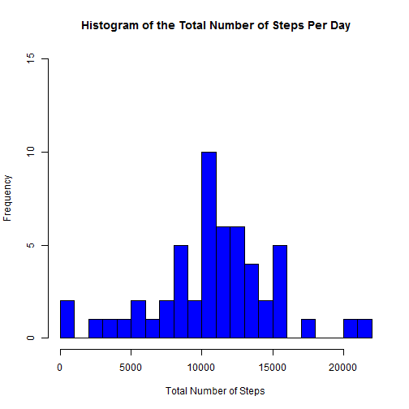
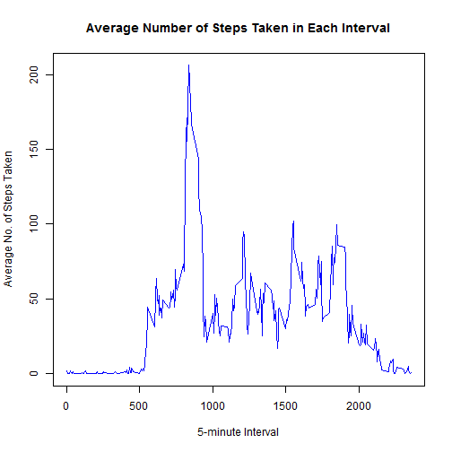
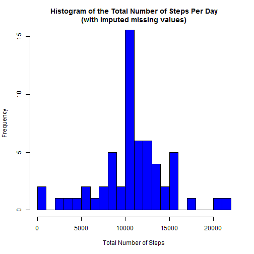
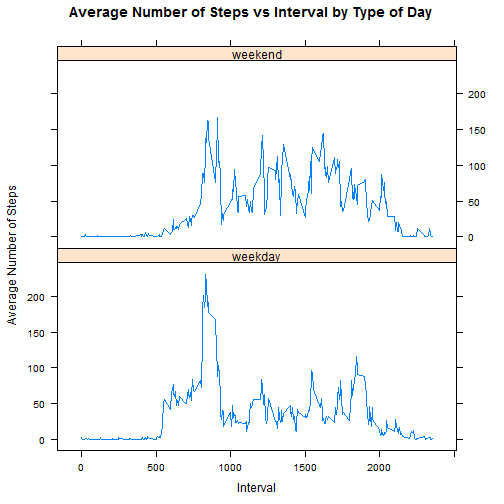

#**Reproducible Research Assignment 1**  
##Personal Activity Monitoring

In this report, I'll first show you how I loaded the Activity monitoring data into R. Then, I'll list each of the assignment questions.  For each question, I'll first describe what I did to answer the question, followed by the R code I used to discover the answer and the output of that R code.  Where relevant, I'll also provide interpretation beneath the output.

**Loading the data**

Here's the code I used to load the data.  Note that in order for this code to work, you must first save the data on your PC and unzip it.  You must then modify the code to specify the path to where you have saved the unzipped file on your PC.


```r
data <- read.csv("C:/Users/Blair/Documents/data/activity.csv")
```

**What is the mean total number of steps taken per day?**

1. Histogram

Per the assignment, I created a histogram of the total number of steps taken each day.  To make this histogram, I aggregated the data by the "date" variable.  Here's the code I used, along with the output.  


```r
agdata <- aggregate (. ~ date, data = data, sum)
hist(agdata$steps, breaks = 20, main = "Histogram of the Total Number of Steps Per Day",
     xlab = "Total Number of Steps", ylim = c(0,15), col = "blue")
```

 

As you can see, the distribution is quite symmetrical.  

2. Mean and median

I calculated both the mean and the median number of steps taken each day. These calculations confirmed that the distribution is virtually symmetrical.  There is only a tiny bit of skewing to the right.  


```r
mean(agdata$steps)
```

```
## [1] 10766
```

```r
median(agdata$steps)
```

```
## [1] 10765
```

**What is the average daily activity pattern?**

1. Plot of the number of steps taken vs the 5-minute interval

Here's a time series plot of the 5-minute interval (x-axis) and the average number of steps taken (y-axis).  The numbers of steps taken are the averages across all of the days.  

Note that in order to create this plot, I once again aggregated the data.  This time, the aggregation was by interval rather than by date.  The aggregation involved taking the mean rather than the sum.  For details, see the code below.


```r
agdata2 <- aggregate (steps ~ interval, data = data, mean)
plot(agdata2$interval, agdata2$steps, type = "l", 
     main = "Average Number of Steps Taken in Each Interval", col = "blue", 
     xlab = "5-minute Interval", ylab = "Average No. of Steps Taken")
```

 

As you can see, the graph above shows a high point between the intervals of 500 and 1000.

2. Interval with the maximum number of steps

The output of the code below gives us the specific interval for which the maximum average number of steps was attained.


```r
agdata2[agdata2$steps == max(agdata2$steps),1]
```

```
## [1] 835
```

**Imputing missing values**

The following calculations explore the presence of missing values in the data and try to correct for any bias by filling them in.

1. Total number of missing values in the dataset

Here is a calculation of the total number of rows in the dataset with missing values.


```r
good <- complete.cases(data)
index <- which(good == "FALSE")
length(index)
```

```
## [1] 2304
```

2. Strategy to fill in the missing values

I chose to fill in the missing values (i.e. the missing values for the "Steps" variable) with the mean for the corresponding 5-minute interval.  Here is the code I used:


```r
agdata3<- merge(data, agdata2, by="interval")
for (i in 1:nrow(agdata3)) {
        if (is.na(agdata3[i,2])) {
                agdata3[i,2] = agdata3[i,4]
        }
}
```

3. New dataset with missing values filled in

With some simple manipulation of the merged data described in the code above, I was able to create a new dataset that is equal to the original dataset.  Here is the code I used:


```r
newdata <- agdata3[,1:3]
colnames(newdata)[2:3] <- c("steps", "date") 
```

4. Histogram, mean & median with imputed values

Now, with this new, more complete dataset, I was able to re-visit the first question of the assignment -- namely, "What is the mean total number of steps taken per day?".  

Once again, I created a histogram.  This time, I aggregated the **new** data by the "date" variable.  Here's the code I used, along with the output.


```r
agdata4 <- aggregate (. ~ date, data = newdata, sum)
hist(agdata4$steps, breaks = 20, main = "Histogram of the Total Number of Steps Per Day\n(with imputed missing values)",
     xlab = "Total Number of Steps", ylim = c(0,15),col = "blue")
```

 

As you can see, this frequency distribution looks virtually the same as the one I created for the first part of the assignment.   The only difference seems to lie with the bar in the middle, which shows a significantly higher frequency.  In other words, my strategy of imputing the missing values by using the mean of the corresponding interval seems to have added values that are clustered around the mean.

Again, I calculated both the mean and the median number of steps taken each day -- this time using the aggregated data used to make the histogram above. 


```r
mean(agdata4$steps)
```

```
## [1] 10766
```

```r
median(agdata4$steps)
```

```
## [1] 10766
```

These calculations confirmed that the mean had not changed, but the median was now the same as the mean.  In other words, the skewing had disappeared. 

**Are there differences in activity patterns betweeen weekdays and weekends?**

To explore the answer to the question above, I used the **new** dataset with the filled-in missing values.   

1. New factor variable with two levels, "weekend" and "weekday"

I first created a new variable in the dataset, to indicate whether a given date is a weekday or weekend day.  I called the new variable "date_type".  Here's the code I used:


```r
x <- gsub("-", "", newdata$date)
y <- as.Date(x, "%Y %m %d")
z <- weekdays(y)
newdata$date_type <- ifelse(z == "Sunday" | z == "Saturday", "weekend", "weekday")
newdata$date_type = factor(newdata$date_type, levels=c("weekday", "weekend"))
```

2.  Plot of average no. of steps taken vs interval by date type

Next, I created a panel plot.  This plot is similar to the one I created in answer to the second question above, but the data in the plot is now augmented by the inclusion of imputed missing values and broken apart by "date_type".  Here's the code I used and the output.


```r
agdata5 <- aggregate (steps ~ interval + date_type, data = newdata, mean)
library(lattice)
xyplot(steps ~ interval | date_type, data = agdata5, layout = c(1,2),
       type = "l", xlab = "Interval", ylab = "Average Number of Steps", 
       main = "Average Number of Steps vs Interval by Type of Day")
```

 

As you can see, the plot shows that during the weekends, fewer steps were taken on average during the intervals of 500 to 1,000 and more steps were taken in the intervals from 1,000 to 2,000 as compared to the weekdays. 

###This marks the end of this report.  Thanks for reading it.

